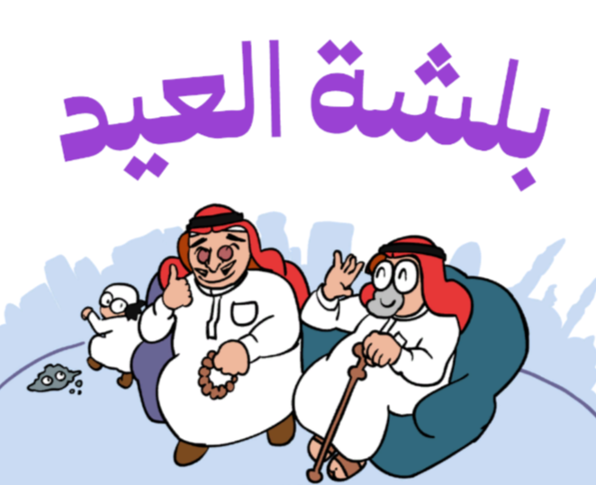

<!-- PROJECT LOGO -->

<h3>   
بلشة العيد

   
  

</h3>   

   

 

 

 

## Project Info
**Role:** Game Programmer
 
**Team Size:** 3
 
**Duration:** 2 week
 
**Tech:** Unity, C#, DoTween 

> [!NOTE]
> **Installation GUIDE:**
>  
> Unity Version: 2023.1.10f1

## Overview
I developed a fast-paced mobile web game with Gamifier, launched during Eid al-Fitr as a festive activity. The experience features a series of random, quick mini-games inspired by fun and relatable Eid situations, designed to keep players engaged and entertained. Each session 

